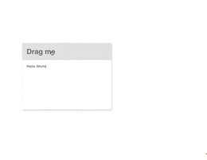

# Drag It

[](https://www.npmjs.com/package/drag-it)
[](https://github.com/Alex-xd/preview-upload)

**Free to drag the HTML element to any place. 🍭**

- Tiny
- No dependence
- High Performance
- Mobile supported
- Easy use


```html
<div class="box">
  <h1>Drag me</h1>
  <p>Hello World</p>
</div>

<script>
  const box = document.querySelector('.box');
  const dragger = new Dragger();
  dragger.draggable(box)
</script>
```

[TRY IT NOW](https://alex-xd.github.io/drag-it/)

## Installation

### Direct download

download source file at `src/drag-it.js` and simply include it.

`<script src="/path/to/drag-it.js"></script>`


### Package Managers & Module Loaders

drag-it supports npm under the name "drag-it".

`npm install drag-it` or `yarn add drag-it`

DragIt can also be loaded as an AMD, CommonJS or ES6 module.

`import dragIt from 'drag-it'`

`const dragIt = require('drag-it')`

`require(['drag-it'], callback)`

## Usage

```html
<div class="box">
  <h1>Drag me</h1>
  <p>Hello World</p>
</div>
```

```javascript
const box = document.querySelector('.box');
const dragger = new Dragger();
dragger.draggable(box)
```


## More

**Fully declare just like this ↓**

```html
<div class="box">
  <h1 class="header">Drag me</h1>
  <p>Hello World</p>
</div>

<script>
  const box = document.querySelector('.box')
  const header = box.querySelector('.header')

  const dragger = new Dragger({
    hasBoundary: false,
    container: document.documentElement,
    overflowLeft: 0,
    overflowRight: 0,
    overflowTop: 0,
    overflowBottom: 0
  })

  dragger.draggable(header, box)
</script>
```


### constructor options object

| param        | means          |default |
|---------------|-------------|---------|
| hasBoundary| has moving boundary |false|
| container| declare a container of mover | \<html> element|
| overflowLeft| the overflow left distance of boundary | 0 |
|    overflowRight|the overflow right distance of boundary | 0 |
|    overflowTop|the overflow top distance of boundary | 0 |
|   overflowBottom|the overflow bottom distance of boundary | 0 |

### instance params

| param | means |required |
|-------|-------|---------|
|dragger|The dom element which trigger dragging, such as the dialog title bar.| yes |
| mover | The dom element which is moving actually, such as the entire dialog. If no declared, the mover will be the dragger. | no|


## License

[MIT](https://github.com/Alex-xd/drag-it/blob/master/LICENSE)
